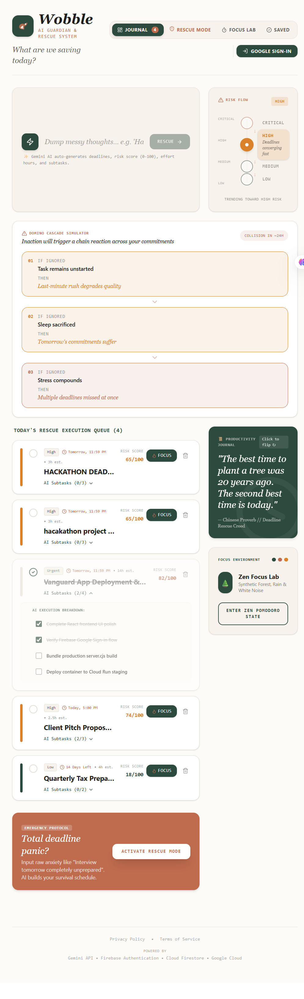
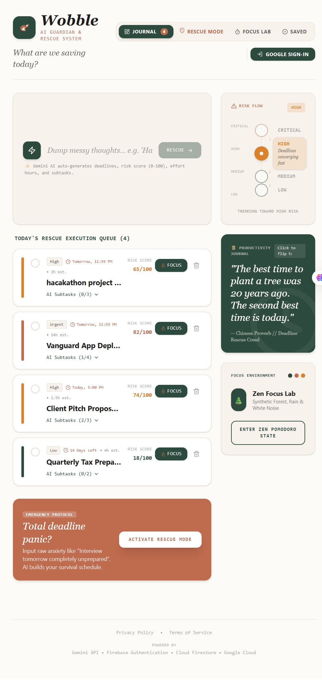
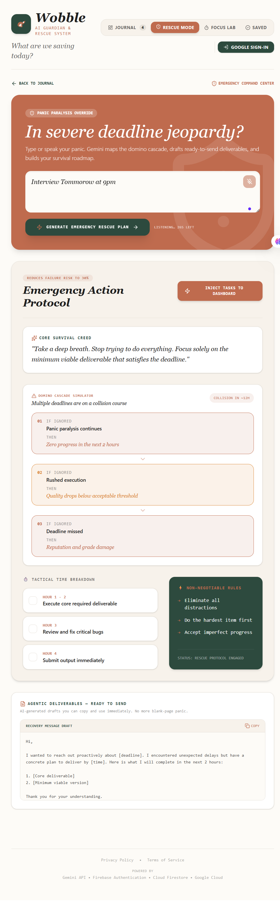
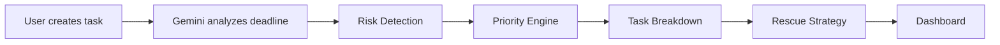

<div align="center">

# 🌌Wobble

### *Projects don't fail suddenly. They wobble first.*

**An AI-powered Deadline Rescue System that predicts project instability, detects cascading risks, and generates intelligent rescue strategies before deadlines are missed.**

> 🚀 Built for the** VIBE2SHIP(codingNinjasXGoogleForDevelopers 2026**)

<!-- Replace with your banner -->

<p align="center">
  
</p>


</div>

---

# ✨ Why Wobble?

Traditional productivity tools remind you **after** you're already behind.

**Wobble** takes a different approach.

Instead of asking:

> *"What should I do next?"*

It asks:

> **"What is most likely to fail—and how can we save it?"**

Using Google's Gemini AI, Wobble analyzes deadlines, workload, urgency, and project complexity to generate personalized rescue plans before projects spiral out of control.

---

# 🚀 Key Highlights

* 🧠 AI-powered task analysis using Gemini
* 🚨 Rescue Mode for last-minute recovery plans
* 📅 Smart deadline planning
* 🎯 Focus Lab with distraction-free Pomodoro sessions
* 🌙 Light & Dark themes
* 🔒 Secure Google Authentication
* ☁️ Built on Firebase & Google Cloud
* 📱 Responsive across desktop and mobile

---

## 📸 Preview

<table>
<tr>
<td align="center">
<b>📊 Dashboard</b><br><br>

</td>

<td align="center">
<b>🚨 Rescue Mode</b><br><br>

</td>

<td align="center">
<b>🎯 Focus Lab</b><br><br>


</td>
</tr>
</table>
## 🌊 Banner

<p align="center">
  
</p>


# 🧠 How It Works



---

# ⚡ Features

| Feature           | Description                                     |
| ----------------- | ----------------------------------------------- |
| 🤖 AI Planning    | Converts natural language into structured plans |
| 🚨 Rescue Mode    | Generates emergency recovery strategies         |
| 📅 Calendar       | Timeline visualization of upcoming work         |
| 🎯 Focus Lab      | Pomodoro timer with ambient environments        |
| 📊 Risk Detection | Detects unstable projects before deadlines      |
| 🔐 Authentication | Secure Google Sign-In                           |
| ☁️ Cloud Sync     | Firebase powered synchronization                |

---

# 🛠 Tech Stack

| Category        | Technology                    |
| --------------- | ----------------------------- |
| Frontend        | React + TypeScript            |
| Styling         | CSS                           |
| Build Tool      | Vite                          |
| AI              | Google AI Studio + Gemini API |
| Database        | Firebase Firestore            |
| Authentication  | Firebase Authentication       |
| Hosting         | Google Cloud                  |
| Version Control | GitHub                        |

---

# 📂 Project Structure

```bash
Wobble/
│
├── public/
├── src/
│   ├── components/
│   ├── pages/
│   ├── hooks/
│   ├── services/
│   ├── firebase/
│   ├── assets/
│   └── utils/
│
├── .env
├── package.json
└── README.md
```

---

# ⚙️ Installation

```bash
git clone https://github.com/yourusername/Wobble.git

cd Wobble

npm install

npm run dev
```

---

# 🔑 Environment Variables

Create a `.env` file.

```env
VITE_FIREBASE_API_KEY=

VITE_FIREBASE_AUTH_DOMAIN=

VITE_FIREBASE_PROJECT_ID=

VITE_FIREBASE_STORAGE_BUCKET=

VITE_FIREBASE_MESSAGING_SENDER_ID=

VITE_FIREBASE_APP_ID=

VITE_GEMINI_API_KEY=
```

---

# ☁️ Deployment

Wobble is designed for deployment on **Google Cloud**.

Deployment stack:

* Firebase Authentication
* Cloud Firestore
* Gemini API
* Google Cloud Hosting / Cloud Run

---

# 🎯 AI Workflow

<details>

<summary><strong>Expand</strong></summary>

1. User creates a task using natural language.

2. Gemini extracts:

* Deadline
* Priority
* Estimated effort
* Subtasks

3. Wobble evaluates project stability.

4. If instability is detected:

* Rescue Mode activates.

5. AI generates:

* Recovery strategy
* Timeline
* Actionable plan

</details>

---

# 🚀 Roadmap

* [x] Google Authentication
* [x] Firebase Integration
* [x] Gemini Task Planning
* [x] Rescue Mode
* [x] Focus Lab
* [x] Responsive UI
* [ ] Calendar Sync
* [ ] Browser Widget
* [ ] Team Collaboration
* [ ] Offline Support

---

# 💡 Challenges

* Designing a productivity experience that feels proactive rather than reactive.
* Balancing AI assistance with user control.
* Optimizing Gemini requests to stay within free-tier limits.
* Building a polished MVP within a hackathon timeline.

---

# 📚 What I Learned

* Building AI-first user experiences.
* Integrating Gemini into real-world workflows.
* Firebase Authentication & Firestore.
* Designing resilient cloud applications on Google Cloud.
* Rapid prototyping with Google AI Studio.

---

# ❤️ Why Wobble Matters

Deadlines rarely fail without warning.

Projects usually show subtle signs of instability long before they collapse.

Wobble helps users recognize those signals early, understand what's causing the risk, and receive actionable AI-powered guidance to recover before it's too late.

---

# 📄 License

Distributed under the MIT License.

See the `LICENSE` file for details.

---

# 👩‍💻 Author

**Neha Rane**

Built with ❤️ for the** VIBE2SHIP (codingNinjasXGoogleForDevelopers**

---

<div align="center">

## ⭐ If you found this project interesting, consider giving it a star!

**Every star helps the project reach more developers and motivates future improvements.2026**

</div>
